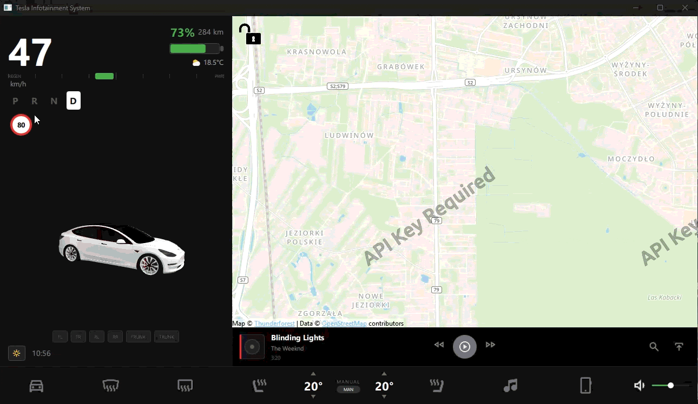

# Tesla Model 3 Infotainment System

Symulacja systemu infotainment Tesli Model 3 zbudowana w Qt Quick/QML. Projekt prezentuje interfejs użytkownika inspirowany systemem multimedialnym Tesli z mapą nawigacyjną, kontrolami pojazdu i nowoczesnym designem.

## 🚗 Funkcje

- **Ekran lewy (LeftScreen)** - Przygotowany do wyświetlania informacji o pojeździe i kontroli systemu
- **Ekran prawy (RightScreen)** - Interaktywna mapa OpenStreetMap z funkcjami:
  - Przesuwanie mapy (drag)
  - Powiększanie/pomniejszanie (pinch, scroll)
  - Obracanie mapy
  - Obsługa skrótów klawiszowych (zoom in/out)
- **Dolny pasek (BottomBar)** - Panel kontrolny z ikonami:
  - Ikona pojazdu elektrycznego
  - Kontrola ogrzewania tylnej szyby (defrostBack)
  - Kontrola ogrzewania przedniej szyby (defrostFront)
- **Model 3D** - Model Tesli Model 3 w formacie GLB/GLTF

## 📋 Wymagania

- **Qt** 6.2 lub nowszy (domyślnie 6.6.2)
- **Qt Quick** 2.15
- **Qt Location** - dla funkcji mapy
- **Qt Positioning** - dla współrzędnych geograficznych
- **Qt 3D** - dla renderowania modelu 3D (opcjonalnie)
- **Kompilator C++** zgodny z Qt (MinGW/MSVC/GCC/Clang)

## 🛠️ Instalacja

### Windows

1. Zainstaluj Qt z [qt.io](https://www.qt.io/download) lub użyj Qt Maintenance Tool
2. Upewnij się, że masz zainstalowane moduły:
   - Qt Quick
   - Qt Location
   - Qt Positioning
   - Qt 3D (opcjonalnie)

### Linux

```bash
# Ubuntu/Debian
sudo apt-get install qt5-qmake qtbase5-dev qtdeclarative5-dev qtlocation5-dev qtpositioning5-dev

# Fedora
sudo dnf install qt5-qtbase-devel qt5-qtdeclarative-devel qt5-qtlocation-devel qt5-qtpositioning-devel
```

### macOS

```bash
brew install qt@5
```

## 🚀 Uruchomienie

### Z Qt Creator

1. Otwórz projekt `Tesla3Screen.pro` w Qt Creator
2. Wybierz odpowiedni kit (kompilator + Qt)
3. Kliknij "Run" (Ctrl+R) lub "Build and Run"

### Z linii poleceń

```bash
# Windows (MinGW)
qmake Tesla3Screen.pro
mingw32-make

# Linux/macOS
qmake Tesla3Screen.pro
make

# Uruchomienie
./Tesla3Screen  # Linux/macOS
Tesla3Screen.exe  # Windows
```

## 📁 Struktura projektu

```
TeslaModel3_InfotainmentSystem/
│
├── main.cpp                 # Punkt wejścia aplikacji
├── main.qml                 # Główny plik QML z layoutem
├── Tesla3Screen.pro         # Plik projektu Qt
├── qml.qrc                  # Zasoby QML (pliki, obrazy, modele)
│
└── ui/
    ├── BottomBar/
    │   └── BottomBar.qml    # Dolny pasek z ikonami kontroli
    │
    ├── LeftScreen/
    │   └── LeftScreen.qml   # Lewy ekran (przygotowany do rozbudowy)
    │
    ├── RightScreen/
    │   └── RightScreen.qml  # Prawy ekran z mapą OSM
    │
    └── assets/
        ├── electric-car.png      # Ikona pojazdu elektrycznego
        ├── defrostBack.png       # Ikona ogrzewania tylnej szyby
        ├── defrostFront.png      # Ikona ogrzewania przedniej szyby
        ├── open_locker.png       # Ikona otwierania zamka
        ├── tesla_model_3.glb     # Model 3D Tesli (GLB)
        └── tesla_model_3.gltf    # Model 3D Tesli (GLTF)
```

## 🎮 Użycie

### Mapa (RightScreen)

- **Przesuwanie**: Kliknij i przeciągnij mapę
- **Zoom**: Użyj gestu pinch (dotyk) lub scroll (mysz)
- **Obracanie**: Obracaj dwoma palcami podczas gestu pinch
- **Skróty klawiszowe**: 
  - `Ctrl +` - Powiększ
  - `Ctrl -` - Pomniejsz

### BottomBar

Ikony w dolnym pasku są przygotowane do dodania funkcjonalności klikalności (onClick handlers).

## 🛠️ Technologie

- **Qt Quick/QML** - Framework UI
- **Qt Location** - Mapy i geolokalizacja
- **OpenStreetMap** - Dostawca map
- **Qt 3D** - Renderowanie 3D
- **C++** - Backend aplikacji

## 📝 Rozwój

Projekt jest w trakcie rozwoju. Planowane funkcje:

- [ ] Interaktywne ikony w BottomBar
- [ ] Pełna funkcjonalność LeftScreen
- [ ] Integracja z systemem pojazdu
- [ ] Więcej kontroli i ustawień
- [ ] Animacje i przejścia

## 📄 Licencja

Ten projekt jest projektem edukacyjnym/demonstracyjnym inspirowanym interfejsem Tesli Model 3.

## 👤 Autor

[pikuskrystian](https://github.com/pikuskrystian)

## 🙏 Podziękowania

- Tesla Inc. - za inspirację designem interfejsu
- Qt Project - za framework Qt
- OpenStreetMap - za dane mapowe
  

